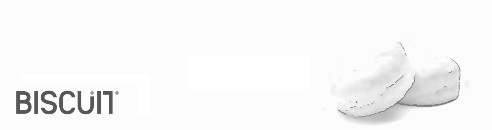

**[Biscuit](http://sblisesivdin.github.io/biscuit)** is a single-page responsive Jekyll theme. This is the most simple and still-good-looking Jekyll theme that you can find. 

## Usage

You can use this theme with [Jekyll](http://jekyllrb.com/) or you can simply use it with [Github Pages](https://pages.github.com).
For local usage just download [Jekyll](http://jekyllrb.com/), use installation guide for more. You can download latest Biscuit from [its Github repository](https://github.com/sblisesivdin/biscuit).

If you prefer to use Github Pages, you do not need to download it, upload files to a new repository...etc., just [fork](https://docs.github.com/en/get-starter/quickstart/fork-a-repo) and use it.

### Files

* `_config.yml`            : Main configuration file.
* `index.md`               : Website page (for now, this page).
* `_includes/head.html`    : File to add custom code to `<head>` section.
* `_includes/scripts.html` : File to add custom code before `</body>`. You can change footer at here.
* `_sass` folder           : Related scss files can be found at this folder.
* `css/main.csss`          : Main scss file.
* `README.md`              : A simple readme file.

## Example tag usage

## Header 1
### Header 2
#### Header 3
**bold**
*italic*

> blockquotes

~~~python
import os,time
print ("Biscuit")
~~~

## Licence and Author Information

Biscuit is derived from currently deprecated theme [Solo](http://github.com/chibicode/solo). The development of Biscuit is maintained by [Sefer Bora Lisesivdin](https://lrgresearch.org/bora).

Biscuit and the previous code where Biscuit is derived are distributed with [MIT license](https://github.com/sblisesivdin/biscuit/blob/gh-pages/LICENSE).
