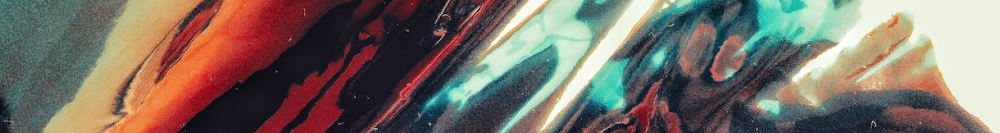

# Creative breakthroughs occur, when worlds collide

*Thai-Nam Hoang, Valentin Peyron, Paul-Bogdan Jurcut, Quentin Esteban, Jan Kokla*

In 2004, American entrepreneur Frans Johansson published the book
*“The Medici Effect: Breakthrough Insights at the Intersection of
Ideas, Concepts, and Cultures”* [[1](https://www.goodreads.com/pt/book/show/20482413)]. 
In other words, by merging ideas from a range of diverse backgrounds,
one can increase the likelihood of intellectual cross-pollination,
which might lead to innovation and success.

## Theory

Before we can dive deep into the movies, let’s first think about the 
concept of “being at the intersection” for a second. Most natural way 
of looking at it is network graphs. With 2 simple examples, we will 
introduce two centrality measures of graphs that we’re going to use 
for quantifying it: **_degree_** and **_betweenness_**.

### Betweenness

If you take a look at the graph below, you see that we have 2 bigger 
clusters and one node that sits at the intersection of the clusters. 
This is exactly what the Medici effect referred to! Visually it all looks 
really simple to grasp right, but how can we quantify it? This is where 
**betweenness** measure comes in.



If you take all pairs of nodes from the graph and find the shortest paths 
between them, then betweenness centrality for a certain node is _the percentage 
of these shortest paths that go through the node_. If you now once again 
take a look at the graph above and focus on the colors of the nodes (you 
can hover over the nodes to see the numerical betweenness measure), you see 
that the lighter the color, the bigger the betweenness. We have 
successfully quantified “being at the intersection” for clustered network graphs.

### Degree

What if we don’t have such clear clusters, but we rather have a big chunk of quite 
similar movies and then some outliers as seen from the graph below? We don’t really 
have nodes that act as bridges between clusters and sit at the intersections. In 
that case, let’s redefine the Medici effect in the movie industry a bit and say 
that the most successful movies will be _the ones that have taken ideas from many 
other movies and thus are connected to the biggest possible number of other nodes_. 
You might already have guessed… degree of the node is exactly what we need.



## What about movies though?
